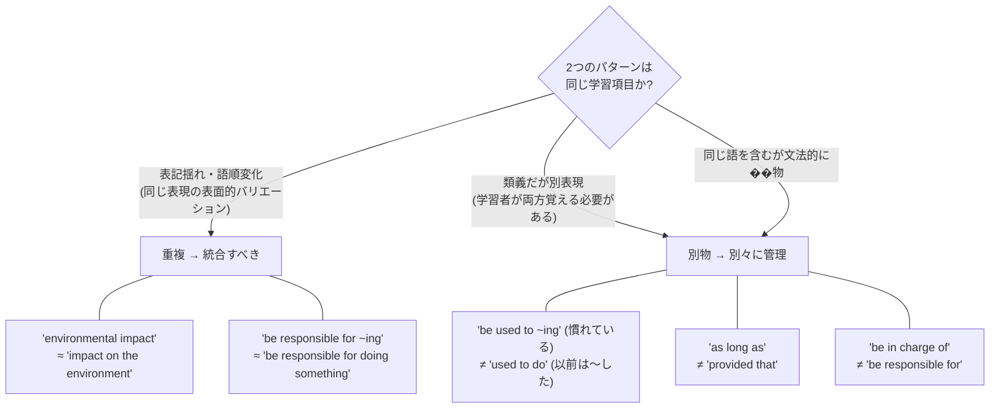
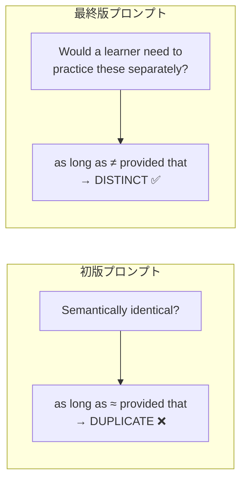

# V3: 意味的重複検出 — 検証結果レポート

**実施日**: 2026-04-06
**ステータス**: 条件付き PASSED

---

## 1. このレポートの読み方

本レポートは、Parla（AI駆動の英語スピーキ��グ学習アプリ）における技術検証の結果を記録し���ものである。Parla の要件定義やアーキテクチャを熟知していなくても、本レポート単体で検証の目的・方法・結論が理解できるように記述している。

---

## 2. 背景: Parla における学習項目と重複検出

### 2.1 学習項目とは

Parla では、ユーザーが英語で「言えなかった表現」を **学習項目** として蓄積（ストック）し、繰り返し練習する。学習項目は抽象的な文法カテゴリ（「比較級」「不定詞」等）ではなく、**具体的なパターン**���ベルで管理する。

```
良い例: "be responsible for ~ing", "environmental impact", "as long as"
悪い例: 「比較級」「コロケーション」（抽象的すぎる）
```

### 2.2 なぜ重複検出が必要か

学習を続けると、ユーザーのストックには数十〜数百の学習項目が蓄積される。新たに抽出された項目が既にストック済みの項目と実質的に同じ場合、重複して登録すると以下の問題が起きる。

- ストックが肥大化���、復習効率が低下する
- 同じパターンが別々の項目として分散し、学習履歴が分断される

一方、過去にストックした項目をユーザーが **再び間違えた**場合、それを「再出」として検知し強調表示する必要がある。

### 2.3 重複検出の難しさ

重複検出は単純な文字列一致では実現できない。以下のような判断が必要になる。



この意味的照合を LLM（Gemini）に委ねることが本アプリの設計方針であり、その精度を検証するのが本実験の目的である。

---

## 3. 検証の問い

> 新規抽出された学習項目と既存ストック済み項目を LLM で意味的に照合し、**重複と再出を正しく判定できるか？** ストック数が増えても精度は維持されるか？

---

## 4. 実験設計

### 4.1 アプローチ: テキストベースの分離検証

本番では LLM #4（フィードバ��ク生成）が発話音声を分析し、その過程で重複検出も���う。しかし V3 の焦点は重複検出の精度であり、音声認識精度は別の検証（V2）で扱う。

そこで本実験では **重複検出に特化したプロンプト** を用い、テキスト入力で検証した。これにより:

- 音声認識の誤りが評価を汚染しない（変数の分離）
- 同じ入力で何度でも再実行できる（再���性）
- テストケースを多く用意できる（効率）

### 4.2 テストケース

3種類のテストケース、計19件を用意した。

| 種別 | 件数 | 期待する判定 | 検証する能力 |
|------|------|-------------|-------------|
| 重複ペア | 5件 | 「既存と同一」 | 表記揺れ・語順変化・形式違いを見抜けるか |
| 非重複ペア | 10件 | 「新規（別物）」 | 類義表現や同じ語を含む別パターンを区別できるか |
| 再出ケース | 4件 | 「再出」 | ストック済み項目の再出を検知できるか |

#### 重複ペア（同一と判定すべき）

| ID | 新規パター��� | ストック内の対応項目 | 変化の種類 |
|----|-------------|-------------------|-----------|
| dup-01 | "A is **much** more X than B" | "A is more X than B" | 修飾語追加 |
| dup-02 | "be responsible for **doing something**" | "be responsible for ~ing" | 表記揺れ |
| dup-03 | "impact on the environment" | "environmental impact" | 語順変化 |
| dup-04 | "take advantage of **something**" | "take advantage of" | 表記揺れ（stock 50+） |
| dup-06 | "A is X-**er** than B" | "A is **more** X than B" | 比較級の形式違い |

#### 非重複ペア（別物と判定すべき）

| ID | 新規パターン | 最も紛らわしいストック項目 | 区別のポイント |
|----|-------------|------------------------|--------------|
| ndp-01 | "the most X"（最上級） | "more X than Y"（比較級） | 文法カテゴリが異なる |
| ndp-02 | "take care of" | "take a look at" | 同じ take だが別の句動詞 |
| ndp-03 | "used to do"（過去の習慣） | "be used to ~ing"（慣れ） | 同じ語だが文法が異なる |
| ndp-04 | "look forward to" | "take a look at" | 別の表現 |
| ndp-05 | "make sure" | "make sense" | 同じ make だが意味が異なる |
| ndp-06 | "in case of" | "in addition to" | 別の前置詞��� |
| ndp-07 | "turn out to be" | （なし） | 完全な新規 |
| ndp-08 | "as long as" | "provided that" | **類義の接続詞だが別表現** |
| ndp-09 | "be in charge of" | "be responsible for" | **類義だが別表現** |
| ndp-10 | "be accustomed to" | "be used to" | **類義だが別表現** |

ndp-08〜10 は特に重要なテス���ケースである。意味は近いが、学習者にとっては別々に覚えて練習すべき異なる表現であり、LLM がこれらを「同一」と統合してしまうと学習機会が失われる。

#### 再出ケース

| ID | パターン | ストック内の対応項目 |
|----|---------|-------------------|
| reap-01 | "be responsible for ~ing" | si-002 |
| reap-02 | "take a look at" | si-005 |
| reap-03 | "environmental impact" | si-003 |
| reap-04 | "be used to ~ing" | si-006 |

### 4.3 スケール条件

ストック済み学習項目リストを 3 段階で用意し、項目数増加時の精度劣化を測定した。

| サイズ | 内容 | 目的 |
|--------|------|------|
| 10個 | テスト対象のコア項目 + ノイズ | ベースライン |
| 50個 | 10個 + 多様なカテゴリから40個追加 | 中規模 |
| 100個 | 50個 + さらに50個追加 | 本番想定規模 |

リストは入れ子構造（10 ⊂ 50 ⊂ 100）とし、条件間の比較を可能にした。

### 4.4 プロンプト設計

検証を通じてプロンプトを反復改善した。��終版の要点:

1. **目的の明示**: 「英語学習アプリのパターン在庫の重複検出」と文脈を与える
2. **判断基準**: 「意味が同じか？」ではなく「**学習者が別々に練習すべ��か？**」
3. **具体例**: 重複・非重複それぞれの例を明示（特に類義表現は別物であることを強調）

> Ask yourself: "Would a learner need to practice these separately to master both?"
> If yes → DISTINCT.

### 4.5 合格基準

[definition.md](definition.md) に定義された基準:

| 観点 | 合格基準 |
|------|---------|
| 重複ペア正答率 | 80% 以上 |
| 非重複ペア正答率 | 90% 以上（過剰統合は学習に悪影響が大きいため厳しめ） |
| 再出検知率 | 85% 以上 |
| スケーラビリティ | ストック 100 個でも上記基準を維持 |

---

## 5. 実験条件

| 項目 | 値 |
|------|-----|
| モデル | gemini-3-flash-preview（LiteLLM 経由） |
| 戦略 | B（重複検出特化プロンプト） |
| ストックサイズ | 10, 50, 100 |
| 実行回数 | 各ケース 1回 |
| 温度 | デフォルト（LiteLLM のデフォルト設定） |

---

## 6. 結果

### 6.1 総合スコア

**53 / 54 正答（98.1%）**

```mermaid
xychart-beta
    title "ストックサイズ別の正答率"
    x-axis ["10個", "50個", "100個"]
    y-axis "正答率 (%)" 60 --> 100
    bar "重複ペア" [100, 100, 75]
    bar "非重複ペア" [100, 100, 100]
    bar "再出検知" [100, 100, 100]
    line "重複の合格ライン (80%)" [80, 80, 80]
    line "非重複の合格ライン (90%)" [90, 90, 90]
```



### 6.2 観点別の結果

| 観点 | 合格基準 | stock=10 | stock=50 | stock=100 | 判定 |
|------|---------|----------|----------|-----------|------|
| 重複ペア | 80%+ | **100%** (4/4) | **100%** (4/4) | 75% (3/4) | 条件付きPASS |
| 非重複ペア | 90%+ | **100%** (10/10) | **100%** (10/10) | **100%** (10/10) | PASS |
| 再出検知 | 85%+ | **100%** (4/4) | **100%** (4/4) | **100%** (4/4) | PASS |

### 6.3 全ケースの結果一覧

```
                  stock=10    stock=50    stock=100
重複ペア:
  dup-01            OK          OK          OK
  dup-02            OK          OK          OK
  dup-03            OK          OK          OK
  dup-04          (skip)      (skip*)       (skip*)
  dup-06            OK          OK         FAIL
非重複ペア:
  ndp-01            OK          OK          OK
  ndp-02            OK          OK          OK
  ndp-03            OK          OK          OK
  ndp-04            OK          OK          OK
  ndp-05            OK          OK          OK
  ndp-06            OK          OK          OK
  ndp-07            OK          OK          OK
  ndp-08            OK          OK          OK
  ndp-09            OK          OK          OK
  ndp-10            OK          OK          OK
再出:
  reap-01           OK          OK          OK
  reap-02           OK          OK          OK
  reap-03           OK          OK          OK
  reap-04           OK          OK          OK

* dup-04 は stock=50+ でのみ対象だが、シナリオ未作成のためスキップ
```

### 6.4 唯一の失敗: dup-06（stock=100）

**入力**: 新規パターン "A is X-er than B" / ストック内に "A is more X than B" (si-001)

**期待**: 重複（比較級の形式違い: -er 形 vs more 形）

**LLM の判定**: 新規（別物）

**LLM の reasoning**:
> Although this pattern shares the same grammatical function as 'A is more X than B' (si-001), they use different morphological rules: one uses the suffix '-er' for short adjectives, while the other uses 'more' for longer adjectives. A learner needs to practice both separately to master the rules governing comparative forms.

**評価**: LLM の論理は一理ある（-er と more は使い分���ルールが異なる）。ただし「A is more X than B」と「A is X-er than B」は同じ比較級パターンの表層形バリエーションであり、別々にストックする必要はない。stock=10, 50 では正しく重複と判定できており、stock=100 でのみ失敗しているため、コンテキスト長の影響が疑われる。

**影響度**: 低い。最悪の場合、比較級が2項目として重複スト���クされるだけで、学習体験への悪影響は軽微。

---

## 7. レイテンシ

| ストック数 | 平均 | 中央値 | 最大 |
|-----------|------|--------|------|
| 10個 | 4,054ms | 3,723ms | 9,241ms |
| 50個 | 4,555ms | 3,878ms | 15,614ms |
| 100個 | 4,631ms | 3,998ms | 17,458ms |

ストック数増加に伴うレイテンシ上昇は穏やかで、本番のバックグラウンド処理（フェーズA中の並列実行）で���れば許容範囲内。

---

## 8. プロンプト改善の経緯

本実験ではプロンプトを反復改善した。その過程で得られた知見を記録する。

### 8.1 初版プロンプト（gemini-2.5-flash）

判断基準を「semantically identical（意味的に同一）」と定義。

**問題**: LLM が「意味が近い」を「同一」と拡大解釈し、以下を誤って統合した:
- "as long as" → "provided that" と同一と判定
- "take care of" → "deal with" と同一と判定

これらは類義ではあるが、学習者が別々に覚えるべき異なる表現である。

### 8.2 最終版プロンプト（gemini-3-flash-preview）

改善点:

1. **目的の明示**: 汎用的な意味類似度判定ではなく「学習アプリのパターン在庫管理」と明示
2. **判断基準の変更**: 「意味が同じか？」→「学習者が別々に練習すべきか？」
3. **類義表現の扱いを明示**: "Synonymous but different expressions" は DISTINCT と明記
4. **失敗ケースを例として追加**: "as long as" ≠ "provided that" 等



### 8.3 テストデータの修正

プロンプト改善の過程で、テストデータ自体の誤りも発見・修正した。

当初「重複ペア」に分類していた以下のケースを「非重複ペア」に再分類:

| パターン | 当初の分類 | 修正後 | 理由 |
|---------|-----------|--------|------|
| "be in charge of" vs "be responsible for" | 重複 | **非重複** | 類義だが別表現。学習者は両方覚える必要がある |
| "be accustomed to" vs "be used to" | 重複 | **非重複** | 同上 |

この修正は、���習項目の管理方針（具体的パターンレベルで管理する）に基づく。

---

## 9. 結論

### 9.1 判定: 条件付き PASSED

合格基準に対する達成状況:

| 基準 | 結果 | 備考 |
|------|------|------|
| 重複ペア 80%+ | stock=10,50: 100% / stock=100: 75% | 100個で1件のみ未達 |
| 非重複ペア 90%+ | 全サイズ 100% | **完全達成** |
| 再出検知 85%+ | 全サイズ 100% | **完全達成** |
| スケール維持 | ほぼ維持 | 100個で重複検知が1件低下 |

唯一の失敗（dup-06, stock=100）は影響度が低く、本番運用で致命的な問題にはならないと判断し、**条件付き PASSED** とする。

### 9.2 本番実装への示唆

1. **プロンプト設計**: 「学習者が別々に練習すべきか？」という判断基準が有効。汎用的な意味類似度ではなく、学習アプリの文脈に即した指示を与えることが重要
2. **類義表現の扱い**: LLM は類義表現を統合する傾向があるため、プロン��トで明示的に「別表現 = 別物」と指示する必要がある
3. **スケーラビリティ**: 100個でも大きな劣化はないが、数百個規模では大分類/サブタグによるフィルタリングを前段に入れることを検討すべき
4. **フォールバック**: 判断に迷う��ースは `review_later`（要確認候補）としてユーザーに委ねる既存の設計が有効に機能する

---

## 10. 実験の再現方法

```bash
# 依存のインストール
uv sync

# 環境変数の設定
export GEMINI_API_KEY="your-api-key"

# 実���の実行（戦略B: 重複検出特化）
uv run python verification/v3-duplicate-detection/run_experiment.py \
  --strategy focused \
  --stock-sizes 10,50,100 \
  --runs 1

# 結果の評価
uv run python verification/v3-duplicate-detection/evaluate.py \
  verification/v3-duplicate-detection/results/<result-file>.json
```

モデルは `verification/v3-duplicate-detection/config.py` の `DEFAULT_MODEL` で変更可能。

---

## 付録: 実験ファイル一覧

```
verification/v3-duplicate-detection/
├── README.md                        実行方法
├── config.py                        モデル・設定
├── models.py                        Pydantic モデル定義
├── prompts.py                       プロンプトテンプレート
├── llm_client.py                    LiteLLM 呼び出し
├── run_experiment.py                実験スクリプト
├── evaluate.py                      評価スクリプト
├── test_data/
│   ├── stock_items_{10,50,100}.json ストック済��学習項目リスト
│   ├── duplicate_pairs.json         重複ペア（5件）
│   ├── non_duplicate_pairs.json     非重複ペア（10件）
│   ├── reappearance_cases.json      再出ケース（4件）
│   └── scenarios.json               テストシナリオ（戦略A用）
└── results/                         実験結果 JSON
```
