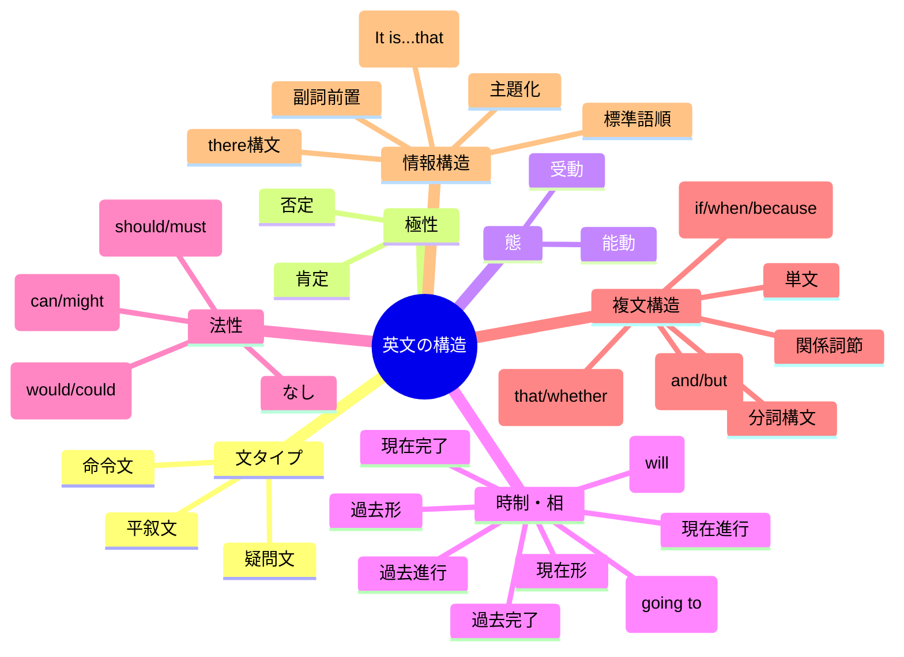
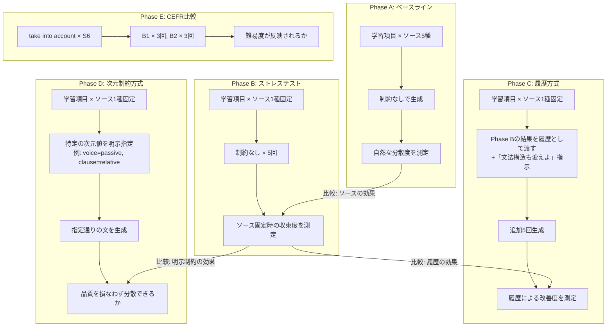
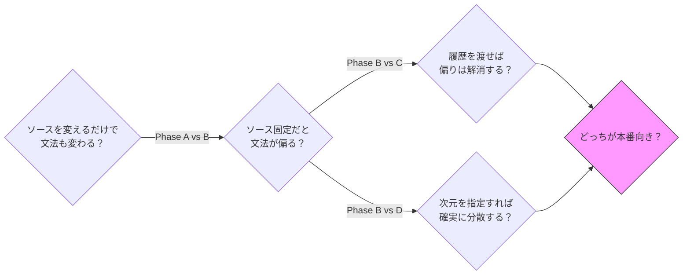
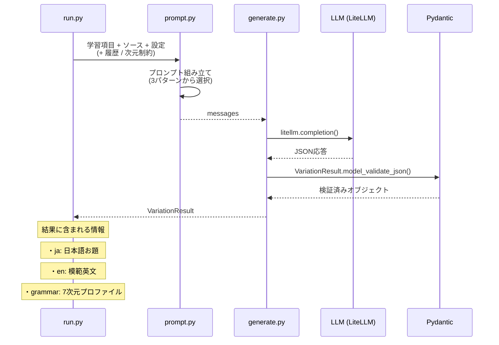
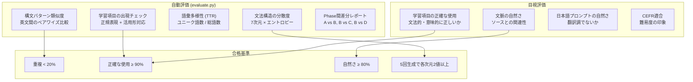
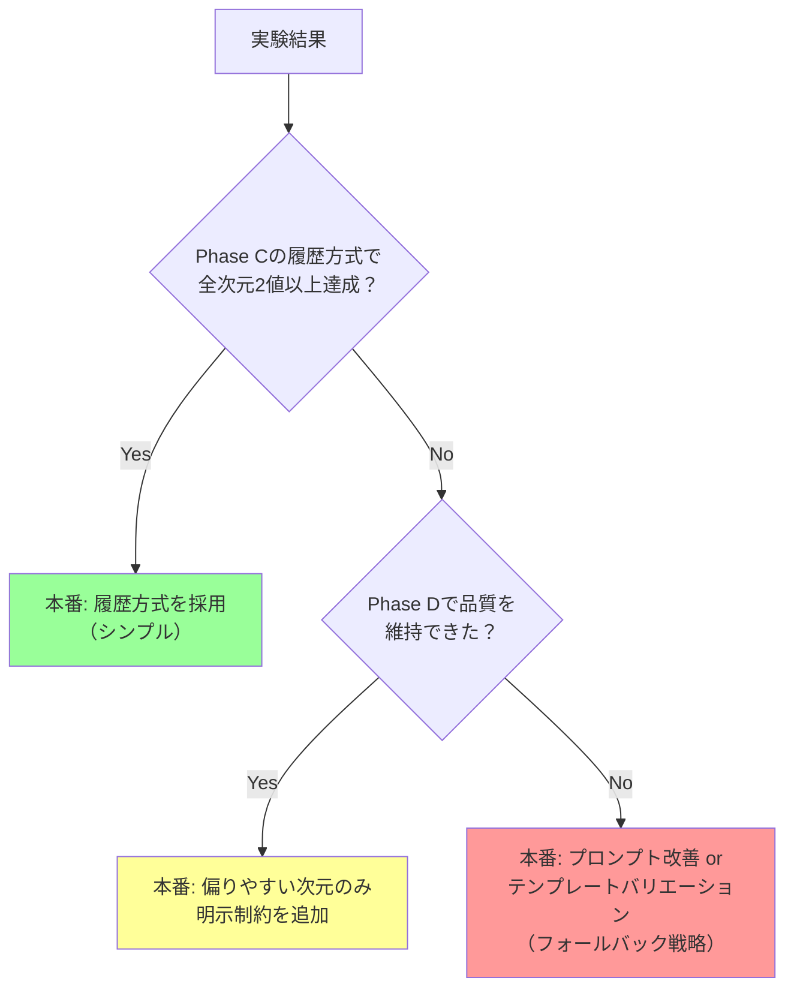

# V7 実験設計の全体像

## 何を検証するのか

「同じ学習項目を10回練習しても、毎回違う文で練習できるか？」

ただし「違う」には2つの軸がある:

1. **内容の多様性** — 話題・語彙・状況が違う
2. **文法構造の多様性** — 文の組み立て方が違う

内容だけ変えても文法が同じだと、学習者は「主語を入れ替えただけ」のパターンに気づいてしまう。

---

## 文法構造の多次元モデル

英文の構造を**7つの独立した次元**で記述する。

```
"The environmental impact should have been taken into account."
  │                         │          │        │
  sentence_type: declarative │          │        │
  polarity: affirmative      │          │        │
  voice: ─────────────────── passive    │        │
  tense_aspect: ─────────────────────── past_perfect
  modality: ──────────────── obligation │        │
  clause_type: ──────────────────────── simple   │
  info_structure: ───────────────────────────── canonical
```

1つの英文は、この7次元の**組み合わせ**で表現される。

### 各次元の値



### なぜ多次元か？

フラットなタグ（「受動態」「疑問文」「条件文」…）だと、**組み合わせを見落とす**。

```
❌ フラットタグ: "passive" → 1種類に見える

✅ 多次元:
   passive + present_simple + declarative  → "It is taken into account."
   passive + past_perfect + interrogative  → "Had it been taken into account?"
   passive + hypothetical + adverbial      → "If it were taken into account, ..."
   → 同じ「受動態」でも全く異なる文になる
```

---

## 5フェーズの実験フロー



---

## 各Phaseが答える問い



| Phase比較 | 問い | 期待される発見 |
|-----------|------|--------------|
| A vs B | ソース多様性 → 文法多様性？ | ソースが違えば文法も自然に変わるか、それとも同じ構文に偏るか |
| B vs C | 履歴+汎用指示 → 改善？ | 「前回と違う構文で」という指示だけでどこまで効くか |
| B vs D | 明示的な次元制約 → 改善？ | 「受動態で書け」等の指定は品質（自然さ）を犠牲にするか |
| C vs D | 本番設計の選択 | 汎用指示で十分か、明示制約が必要か |

---

## 1回の生成で何が起きるか



---

## 評価のしくみ



### 文法分散度の測定例

ある学習項目を5回生成した結果:

```
生成1: declarative / affirmative / active  / present_simple  / none       / simple   / canonical
生成2: declarative / affirmative / active  / present_simple  / obligation / simple   / canonical
生成3: declarative / affirmative / passive / present_perfect / none       / relative / canonical
生成4: interrogative/ affirmative/ active  / past_simple     / none       / adverbial/ canonical
生成5: declarative / negative   / active  / future_will     / possibility/ simple   / fronted_adverbial
```

次元別の分散:

| 次元 | 使用された値 | ユニーク数 | 偏り |
|------|------------|-----------|------|
| sentence_type | declarative×4, interrogative×1 | 2 | やや偏り |
| polarity | affirmative×4, negative×1 | 2 | やや偏り |
| voice | active×4, passive×1 | 2 | やや偏り |
| tense_aspect | present_simple×2, 他3種 | 4 | **良好** |
| modality | none×3, obligation×1, possibility×1 | 3 | まあまあ |
| clause_type | simple×3, relative×1, adverbial×1 | 3 | まあまあ |
| info_structure | canonical×4, fronted×1 | 2 | **偏り大** |

→ `info_structure` が最も偏りやすい次元と判明 → 本番設計でこの次元を制約対象にする

---

## 本番設計への示唆（実験後の意思決定）


