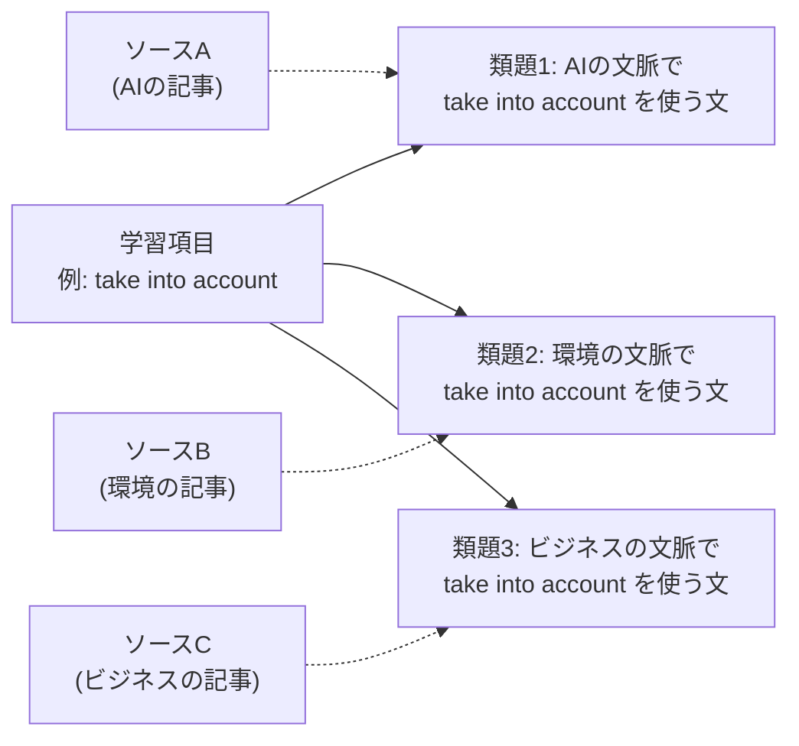
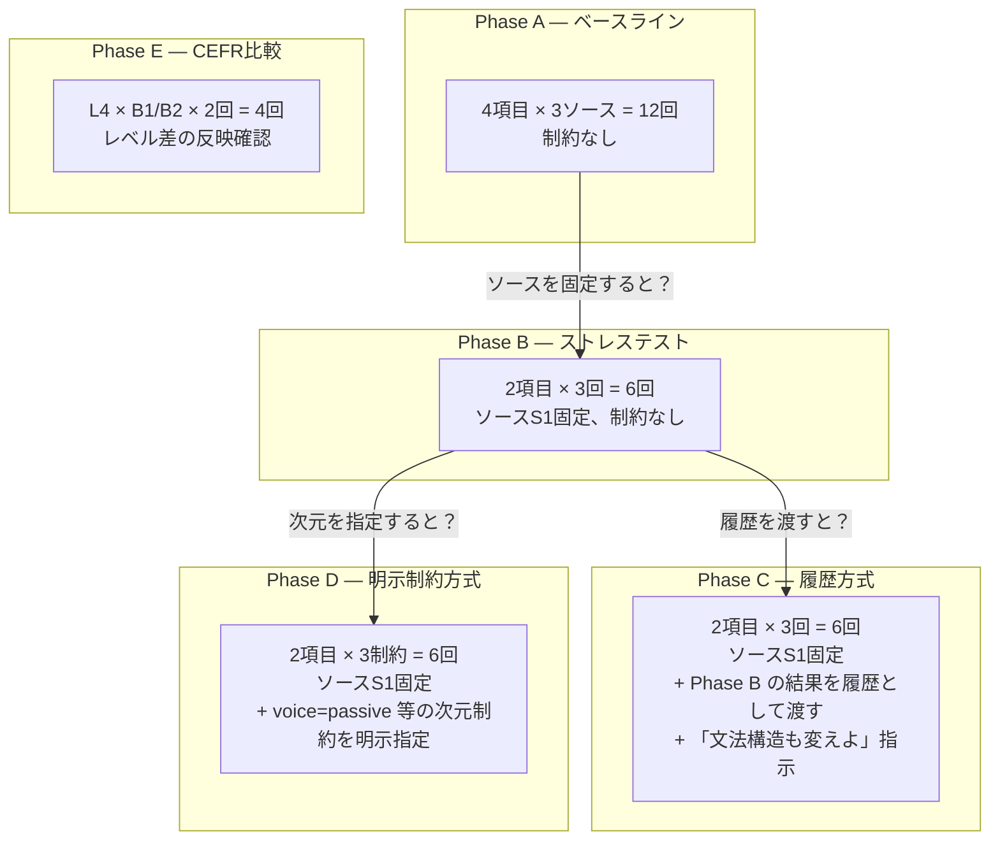
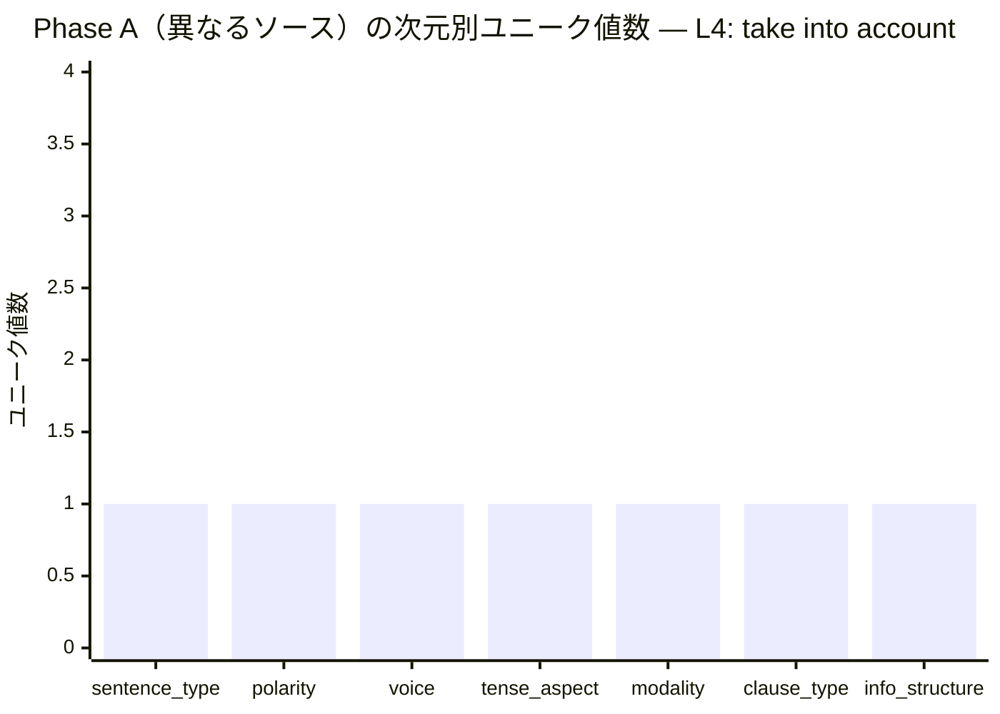
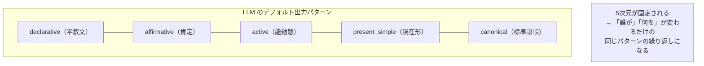
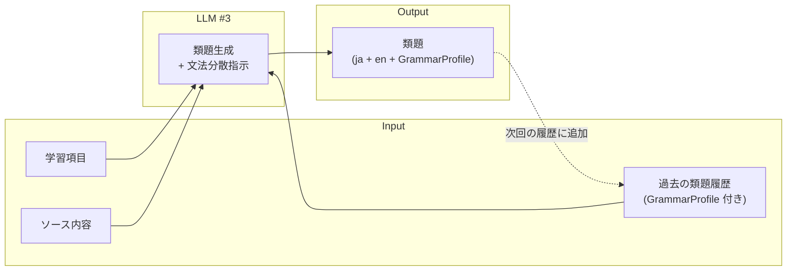

# V7: 類題生成の品質と多様性 — 検証結果

- **実施日**: 2026-04-06
- **モデル**: gemini-3-flash-preview（LiteLLM経由）
- **CEFR**: B1 / American English
- **合計生成数**: 34回（Phase A: 12, B: 6, C: 6, D: 6, E: 4）

---

## 検証の背景と目的

### Parla における SRS レビューの仕組み

Parla は英語スピーキング学習アプリであり、SRS（Spaced Repetition System）で学習項目を復習する。SRS レビュー（ブロック1）では、過去にストックした学習項目を **毎回異なる文脈で** 練習する。



同じ文脈で繰り返すと、学習者はパターンではなく **特定の文を暗記** してしまい、「文脈非依存の定着」が達成できない（[06-srs-mastery.md](../../requirements/06-srs-mastery.md) 参照）。

### この検証で答える問い

> 同一の学習項目に対して、LLM（#3 類題生成）は毎回異なる文脈で自然な類題を生成し続けられるか？

「異なる」には2つの軸がある:

1. **内容の多様性** — 話題・語彙・状況が違う
2. **文法構造の多様性** — 文の組み立て方（時制・態・文タイプ等）が違う

内容だけ変わっても文法構造が同じだと、学習者は「主語を入れ替えただけ」のパターンに気づく。**両方の軸で多様性を確保できるか** が検証のポイントである。

---

## 実験設計

### 文法構造の多次元モデル

英文の構造を **7つの独立した次元** で記述し、多様性を定量的に測定する。

| 次元 | 値の例 | 何を捉えるか |
|------|--------|-------------|
| sentence_type | declarative / interrogative / imperative | 文タイプ |
| polarity | affirmative / negative | 肯定・否定 |
| voice | active / passive | 能動態・受動態 |
| tense_aspect | present_simple / past_simple / present_perfect / future_will / ... | 時制・相 |
| modality | none / obligation / possibility / hypothetical | 法助動詞 |
| clause_type | simple / compound / adverbial / relative / noun_clause / participial | 複文構造 |
| info_structure | canonical / fronted_adverbial / cleft / there_construction / topicalization | 情報構造 |

1つの英文は7次元の組み合わせとして表現される。例:

```
"The risks had already been taken into account."
 → declarative / affirmative / passive / past_perfect / none / simple / canonical
```

LLM には英文とともにこの7次元の自己申告（GrammarProfile）を出力させた。

### テスト対象の学習項目

| ID | 学習項目 | カテゴリ | 選定理由 |
|----|---------|---------|---------|
| L1 | "be responsible for ~ing" | 構文 | 動名詞補語が固定、主語・時制に自由度 |
| L2 | "environmental impact" | コロケーション | 名詞句、文中位置に自由度 |
| L3 | "more X than Y" | 文法（比較級） | 比較対象の品詞に自由度 |
| L4 | "take into account" | 表現（句動詞） | 分離可能句動詞、全次元で自由度が高い |

### ソーステキスト

8本の英文記事（200〜400語）を用意。ジャンルの差を最大化した。

| # | ジャンル | トピック |
|---|---------|---------|
| S1 | テクノロジー | AIの社会的影響 |
| S2 | 環境 | 海洋プラスチック問題 |
| S3 | ビジネス | リモートワークの変遷 |
| S4 | 健康 | 睡眠と生産性 |
| S5 | 文化 | 日本の祭りと地域活性化 |
| S6 | 教育 | プログラミング教育の是非 |
| S7 | 食・農業 | フードマイレージ |
| S8 | スポーツ | eスポーツの五輪議論 |

### 5フェーズの実験条件

各フェーズは段階的に条件を変え、**何が多様性に効くか** を特定する。



| Phase | 問い | コール数 |
|-------|------|---------|
| A | ソースを変えるだけで文法も変わるか？ | 12 |
| B | ソース固定だと文法が収束するか？ | 6 |
| C | 履歴+汎用的な分散指示で改善するか？ | 6 |
| D | 次元を明示指定すれば確実に分散するか？ | 6 |
| E | CEFRレベルが難易度に反映されるか？ | 4 |

---

## 結果

### 合格基準との対照

定義（definition.md）の合格基準に対する結果:

| 観点 | 基準 | 結果 | 判定 |
|------|------|------|------|
| 学習項目の正確な使用 | 90% 以上 | **100%**（全34回） | **PASS** |
| 内容の重複 | 明確な重複 20% 未満 | 重複なし（目視確認） | **PASS** |
| 文法構造の多様性 | 各次元で2値以上 | Phase C の L4 のみ PASS | **条件付き PASS** |
| 文脈の自然さ | 80% 以上 | 全文自然（目視確認） | **PASS** |

**最終判定: 条件付き PASS** — 履歴方式（Phase C）を使えば句動詞タイプ（L4）は合格基準を満たす。構文タイプ（L1）は polarity と voice の分散に課題が残る。

### Phase A/B: 制約なしでの文法分布

制約なしでは、**ソースを変えてもほぼ同じ文法構造に収束** する。



L4 の Phase A では **全7次元が1種（declarative / affirmative / active / present_simple / obligation / adverbial / canonical）** に収束。ソースが AI / 環境 / ビジネスと変わっても、LLM は「〜する際、...を考慮に入れるべきだ」という同じ構文パターンを繰り返した。

Phase B（同一ソース）も同様の収束を示し、**ソースの多様性は文法構造の多様性にほぼ寄与しない** ことが確認された。

#### Phase A の生成例（L4: take into account、3回とも同じ構文）

| # | ソース | 英文 | 文法プロファイル |
|---|--------|------|-----------------|
| 1 | AI | Governments should take into account the potential risks of bias when they create new regulations for AI. | decl/aff/act/pres_simple/**obligation**/**adverbial**/canonical |
| 2 | 環境 | Companies must take into account the environmental impact when they design new types of packaging. | decl/aff/act/pres_simple/**obligation**/**adverbial**/canonical |
| 3 | ビジネス | Managers should take into account the commute time of employees when they decide on a new hybrid work policy. | decl/aff/act/pres_simple/**obligation**/**adverbial**/canonical |

→ 主語と目的語が変わっただけで、構文は完全に同一。

### Phase C: 履歴方式の効果

Phase B の結果を履歴としてプロンプトに含め、「まだ使っていない文法次元の値を優先せよ」と指示した結果、**劇的な改善** が見られた。

```mermaid
xychart-beta
    title "Phase B vs C — L4 の次元別ユニーク値数"
    x-axis ["sentence_type", "polarity", "voice", "tense_aspect", "modality", "clause_type", "info_structure"]
    y-axis "ユニーク値数" 0 --> 4
    bar "Phase B" [1, 1, 1, 1, 1, 1, 2]
    bar "Phase C" [2, 2, 2, 3, 2, 3, 2]
```



| 次元 | Phase B | Phase C | 変化 |
|------|---------|---------|------|
| sentence_type | declarative×3 | declarative×2, **interrogative×1** | ↑ |
| polarity | affirmative×3 | affirmative×2, **negative×1** | ↑ |
| voice | active×3 | active×2, **passive×1** | ↑ |
| tense_aspect | present_simple×3 | **past_simple×1, present_simple×1, future_will×1** | ↑↑ |
| modality | obligation×3 | **none×2**, obligation×1 | ↑ |
| clause_type | adverbial×3 | **simple×1, relative×1, noun_clause×1** | ↑↑ |
| info_structure | canonical×2, fronted×1 | canonical×2, **there_construction×1** | = |

**L4 は全7次元で2値以上を達成 → PASS。**

#### Phase C の生成例（L4: take into account）

| # | 英文 | 文法の特徴 |
|---|------|-----------|
| 1 | Did the developers take into account the risk of bias in their facial recognition systems? | **疑問文・過去形** |
| 2 | There are many ethical concerns that must be taken into account before AI is used in classrooms. | **受動態・there構文・関係詞節** |
| 3 | Many experts worry that future laws will not take into account the privacy of citizens enough. | **否定・未来形・名詞節** |

→ 3文とも異なる文法構造で、かつ自然な英文。

#### L1 の改善状況

L1（be responsible for ~ing）でも4次元で改善が見られたが、**polarity（常に affirmative）と voice（常に active）は変化しなかった**。

| 次元 | Phase B → C | 改善 |
|------|-------------|------|
| sentence_type | 1種 → 2種 | ↑ |
| polarity | 1種 → 1種 | **変化なし** |
| voice | 1種 → 1種 | **変化なし** |
| tense_aspect | 1種 → 3種 | ↑↑ |
| modality | 1種 → 2種 | ↑ |
| clause_type | 2種 → 2種 | = |
| info_structure | 1種 → 2種 | ↑ |

L1 の polarity/voice が変化しなかった理由は、"be responsible for" 構文が否定文（"not be responsible for"）や受動態（"be held responsible"）で使われる頻度が相対的に低く、LLM が自然さを優先して回避したと推測される。

### Phase D: 明示制約の効果

特定の次元値を明示指定（例: `voice=passive, tense_aspect=past_perfect`）した場合:

**良い点**: 指定した次元は正しく反映された。

| 制約 | 生成された英文 | 制約遵守 |
|------|--------------|---------|
| passive + past_perfect | The potential risks of automation **had** already **been taken into account** before the government introduced the new AI regulations. | OK |
| interrogative + hypothetical | If the government introduced new AI regulations, **would** they **take into account** the privacy of every citizen? | OK |
| imperative + simple | Always **take into account** the potential for bias in AI systems during your research. | OK |

**課題**: 指定していない次元が canonical に収束する傾向。

| 比較 | info_structure のユニーク値数 |
|------|---------------------------|
| Phase B | 2種（canonical, fronted_adverbial） |
| Phase D | **1種（canonical のみ）** ← 退行 |

明示制約にリソースを使うことで、非指定次元への注意が低下すると思われる。

### Phase E: CEFR レベル比較

B1 と B2 で各2回生成。サンプル数が少ないため参考値。

| レベル | 平均文長（語数） | 構文 |
|--------|----------------|------|
| B1 | 18.0 | obligation + adverbial + fronted_adverbial |
| B2 | 19.0 | obligation + adverbial + canonical |

文長にわずかな差はあるが、**構文パターンや語彙レベルに顕著な差は見られなかった**。CEFR レベル制御は今回のサンプルでは検証不十分であり、本格的な検証は別途必要。

---

## 考察

### LLM の強み

- **学習項目の正確な使用は完璧**（100%）— 全生成で文法的・意味的に正しく使われた
- **内容の多様性は十分** — ソースの内容を活かした自然な文脈が生成された
- **日本語プロンプトの品質が高い** — 翻訳調でなく、自然な日本語のお題
- **履歴方式への応答性が高い** — 過去の生成を見せるだけで、大幅に文法構造を変えられる

### LLM の弱点

- **制約なしでは文法構造が強く収束する** — 特に L4 は「should/must + 動詞 + when 節」に固定
- **polarity（肯定/否定）の分散が最も困難** — 否定文は自然に生成されにくい
- **明示制約は非指定次元を犠牲にする** — 全次元を同時に制御するには不向き

### 文法構造の収束傾向



これは言語学的に自然な傾向（無標形への収束）であり、**意図的な分散指示なしでは文法的多様性は確保できない** ことを示している。

---

## 本番設計への提言

### 推奨アーキテクチャ: 履歴方式（Phase C）の採用



**理由**:
- Phase C で L4（句動詞）は全7次元で合格基準を達成
- 明示制約（Phase D）は非指定次元が犠牲になるため全面採用は非推奨
- 履歴方式はプロンプト長の増加というコストはあるが、本番で想定される履歴数（10件程度）なら許容範囲

### 補助策: 偏りやすい次元への個別対応

L1 の polarity/voice のように、履歴方式だけでは分散しない次元がある。以下の補助策を検討:

| 対策 | 適用タイミング | コスト |
|------|-------------|--------|
| 「否定文や受動態も使うこと」をシステムプロンプトに常時追加 | 全生成 | 低 |
| 履歴内の次元分布を事前分析し、偏っている次元のみ制約追加 | 履歴蓄積後 | 中 |
| 一定回数ごとに強制的に文タイプを指定（疑問文 / 命令文 等） | ローテーション | 低 |

---

## フォールバック戦略の評価

definition.md に記載されたフォールバック戦略の有効性:

| 戦略 | 今回の検証結果 | 推奨度 |
|------|--------------|--------|
| 過去の類題履歴をプロンプトに含める | **有効**。Phase C で大幅改善を確認 | **推奨** |
| テンプレートバリエーション（疑問文、否定文等）を指定 | Phase D で動作確認。品質は維持されるが非指定次元が犠牲 | 補助的に使用 |
| ソース文脈の使用を諦め汎用文脈で生成 | 未検証。ソース変更だけでは文法が変わらないため効果は限定的 | 非推奨 |

---

## 実験の制約事項

- **サンプル数が少ない**（Phase B/C/D は各項目3回）— 傾向は読み取れるが統計的有意差は主張できない
- **学習項目が4種のみ** — より多様なカテゴリ（idiom、phrasal verb、文法パターン等）での追試が望ましい
- **GrammarProfile は LLM の自己申告** — 実際の文法構造と乖離がある可能性（未検証）
- **CEFR レベル制御は検証不十分** — サンプル数を増やした別検証が必要

---

## 次のステップ

1. **本番プロンプトの実装**: Phase C 方式（履歴 + GrammarProfile + 文法分散指示）を LLM #3 の本番プロンプトに組み込む
2. **polarity/voice の補助策検証**: システムプロンプトに「否定文や受動態も使うこと」を追加した場合の効果を確認
3. **CEFR レベル制御の追試**: B1/B2/A2 等、レベル差が出力に反映されるかをより大きなサンプルで検証
4. **GrammarProfile の妥当性検証**: LLM の自己申告が実際の文法構造と一致しているかをスポットチェック
