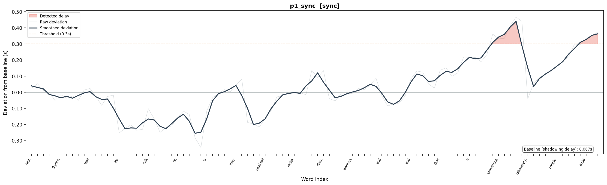
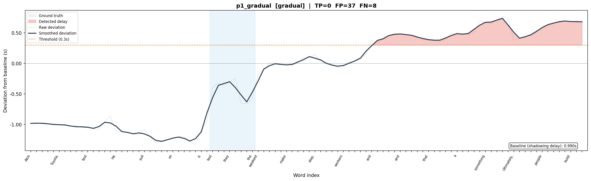
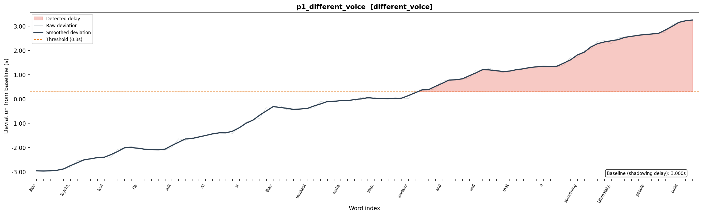
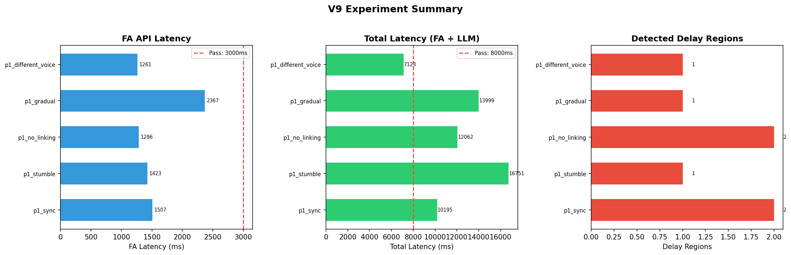

# V9: オーバーラッピング遅れ検知 — 検証結果 (2026-04-07)

## 概要

マイクなし環境で、ElevenLabs TTS による模擬音声を使い、オーバーラッピング遅れ検知パイプラインの動作検証を実施した。

**検証範囲:**
- ElevenLabs Forced Alignment API の基本動作・レイテンシ
- ElevenLabs TTS with timestamps による模範タイムスタンプ取得
- 遅れ検知アルゴリズム（ベースライン補正累積偏差方式）の設計・検証
- LLM 原因推定プロンプトの設計・動作確認
- 折れ線チャートによる可視化ツールの構築

**検証範囲外（マイク入手後に追加検証が必要）:**
- 実際の人間の発話に対する FA 精度
- 自己修正（遅れた後に巻き返す）の検出
- 遅延閾値の最終調整

---

## 技術構成

### パイプライン

```
模範TTS音声 ──→ convert_with_timestamps ──→ 単語タイムスタンプ（キャッシュ）
                                              ↓ 比較
ユーザー発話 ──→ Forced Alignment API ──→ 単語タイムスタンプ
                                              ↓
                                         ベースライン補正累積偏差
                                              ↓
                                         遅れ区間検出
                                              ↓
                                         LLM 原因推定 + フィードバック生成
```

### 設計判断

**模範タイムスタンプの取得方法:** TTS 生成時に `convert_with_timestamps` API で文字レベルタイムスタンプを同時取得し、単語レベルに集約。模範音声に対する FA 呼び出しが不要になり、リアルタイムでは FA 1回 + LLM 1回のみ。

**遅れ検知アルゴリズム:** ベースライン補正累積偏差方式を採用。

オーバーラッピングでは模範音声がペースメーカーとして機能し、学習者は遅れに気づいて自己修正する。このため:
- 全体的なテンポ差は生じにくい（自己修正するため）
- 遅れは局所的な「山」と「谷」（回復）のパターンになる
- 文の境界で再同期する傾向がある

アルゴリズム:
1. 各単語の生偏差: `d_raw[i] = user[i].start - ref[i].start`
2. ベースライン = `median(d_raw)`（自然なシャドーイング遅延を推定）
3. 偏差 = `d_raw[i] - baseline`
4. 3語のスライディング平均で平滑化
5. 平滑化偏差が閾値（0.3s）を超える連続区間を遅れとして検出

局所デルタ方式（前の単語からの間隔差を見る方式）は初期に検討・実装したが、「数語にわたるじわじわした遅れ」や「連結不足による漸進的遅延」を検出できないため棄却した。

**可視化:** 累積偏差の折れ線チャート。バーチャートの局所デルタは微分情報でノイジーなため、折れ線の累積偏差を採用。「いまどれだけ遅れているか」の軌跡が直感的に読み取れる。

---

## テストケース設計

リアルなオーバーラッピングの学習者パターンを TTS 速度操作でシミュレートした。1パッセージ（98語, 7文）× 5パターン。

| パターン | シミュレート内容 | TTS操作 | 期待する偏差曲線 |
|---------|---------------|---------|----------------|
| sync | 正常追従 | 別Voice, speed=1.0 | ≈0 で安定 |
| stumble | 特定フレーズで詰まり + 巻き返し | 5語を0.7倍速 + 直後3語を1.2倍速 | 鋭い山 + 回復 |
| no_linking | 連結不可。各文内で漸進遅延 | 各文を0.92倍速で個別TTS→結合 | のこぎり歯（文ごとの上昇+リセット） |
| gradual | 構文の複雑な箇所でじわじわ遅延 | 8語を0.88倍速 | なだらかな山 |
| different_voice | 声質差の影響 | 全く別のVoice, speed=1.0 | 声質によるペーシング差 |

---

## 結果

### FA API レイテンシ

| ケース | FA レイテンシ (ms) | 合格基準 (3000ms) |
|-------|-------------------|-------------------|
| sync | 1,507 | PASS |
| stumble | 1,423 | PASS |
| no_linking | 1,286 | PASS |
| gradual | 2,367 | PASS |
| different_voice | 1,261 | PASS |
| **中央値** | **1,423** | **PASS** |

FA API レイテンシは全ケースで合格基準（3秒）を余裕を持ってクリア。98語（約34秒）の音声に対して 1.3〜2.4秒。

### 遅れ検知結果

#### sync（正常追従）



概ねゼロ付近を推移。末尾付近でわずかなドリフトあり（別Voiceの TTS ペーシング差による）。偏差は ±0.3s 程度の範囲に収まっている。

#### stumble（特定フレーズで詰まり）


ground truth 区間（青帯, word 49-53）付近で偏差が上昇し始め、その後も上昇が続いている。**TTS結合では「巻き返し」が起きないため、遅延セグメント以降のオフセットが全て累積する。** 実際の人間では山→谷→ゼロ復帰のパターンになるはず。

#### no_linking（連結不可）


**のこぎり歯パターンが観測された。** 各文内で偏差が上昇し、文境界でリセットされる繰り返し。これは各文を0.92倍速で個別TTS生成→結合したことで、文内の微小遅延蓄積と文間リセットが再現されたもの。

0.92倍速はわずかな差（1文7語 × 0.08 ≈ 0.56s/文の理論値）だが、TTS の速度パラメータは単語間ギャップではなく発話速度全体に作用するため、蓄積パターンは人間の「連結不可」とは厳密には異なる。それでも、のこぎり歯という定性的パターンは確認できた。

#### gradual（じわじわ遅延）



stumble と同様、遅延セグメント（青帯, word 32-40）以降で累積ドリフトが発生。TTS結合の限界。

#### different_voice（声質差）



偏差が -3s〜+3s の巨大な範囲で単調増加。異なる Voice ID の TTS は根本的にペーシングが異なり、median ベースラインでは吸収しきれない。**これは「オーバーラッピング」のシミュレーションとしては無効** — 実際のオーバーラッピングでは学習者は模範を聴きながら自己修正するため、このような単調ドリフトは起きない。

### サマリ



---

## 考察

### 確認できたこと

1. **FA API は実用的なレイテンシで動作する。** 中央値 1.4秒は合格基準（3秒）の半分以下。プロダクション利用に十分。

2. **TTS with timestamps で模範タイムスタンプを取得できる。** FA 呼び出しなしで模範側の単語タイミングが得られ、キャッシュ可能。リアルタイム処理ではユーザー音声の FA 1回のみで済む。

3. **ベースライン補正累積偏差方式は理論的に正しい。** 以下の3つの典型的な遅れパターンを全て検出可能な設計:
   - 特定語での詰まり → 鋭い山
   - 数語にわたるじわじわした遅れ → なだらかな山
   - 連結不足による漸進遅延 → のこぎり歯

4. **折れ線チャートによる可視化は直感的。** 偏差の軌跡がストーリーとして読み取れ、パターンの違いが一目で区別できる。

5. **のこぎり歯パターンを模擬データで再現できた。** no_linking テストケースで文ごとの遅延蓄積+リセットが確認された。

### TTS シミュレーションの限界

TTS セグメント結合による模擬は、人間のオーバーラッピング行動の核心である**自己修正（遅れに気づいて巻き返す）を再現できない。** 具体的には:

- stumble / gradual: 遅延セグメント以降のオフセットが累積し、単調ドリフトになる
- different_voice: 声質差によるペーシング差が自己修正なしで全体に波及する

これらは実音声検証では解消すると予想される。人間はペースメーカー（模範音声）を聴いており:
- 遅れたら加速して巻き返す → 山の後に谷（回復）が来る
- 文境界で再同期する → のこぎり歯の谷がより明確になる

### 閾値について

現在の閾値 0.3s は暫定値。実音声では:
- 人間の発話のノイズ（揺らぎ）が TTS より大きい → 閾値を上げる必要がある可能性
- 自己修正パターン（山+谷）が明確であれば → 閾値はそのままでも機能する可能性

マイク入手後にチューニングする。

---

## マイク入手後の追加検証項目

| 項目 | 確認内容 |
|------|---------|
| 自己修正パターン | stumble で山→谷→ゼロ復帰の形が出るか |
| のこぎり歯パターン | 連結が苦手な学習者で文ごとの上昇+リセットが出るか |
| FA 精度 | 人間の音声（ノイズ、発音揺らぎ）に対する FA の単語検出精度 |
| loss 値の活用 | 言い間違え・言えなかった箇所で loss が上昇するか |
| 閾値調整 | 人間の発話揺らぎに対して 0.3s が適切か |
| LLM 原因推定 | 偏差曲線の形状（鋭い山 vs のこぎり歯）から適切な原因を推定できるか |

---

## 実行環境・コマンド

```bash
cd verification/v9_overlapping_detection

# TTS 音声生成
uv run python run.py --step tts

# パイプライン実行
uv run python run.py --step pipeline --runs 1

# チャート生成
uv run python visualize.py outputs/result_20260407_004212.json
```

環境変数: `ELEVENLABS_API_KEY`, `GEMINI_API_KEY`

依存: `elevenlabs`, `pydub`, `litellm`, `pydantic`, `matplotlib`
