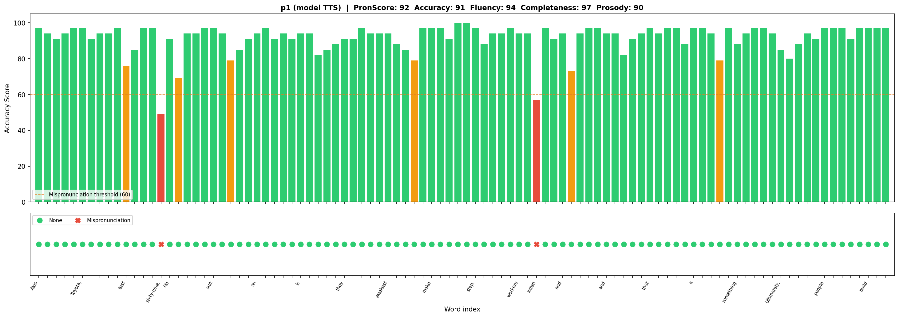
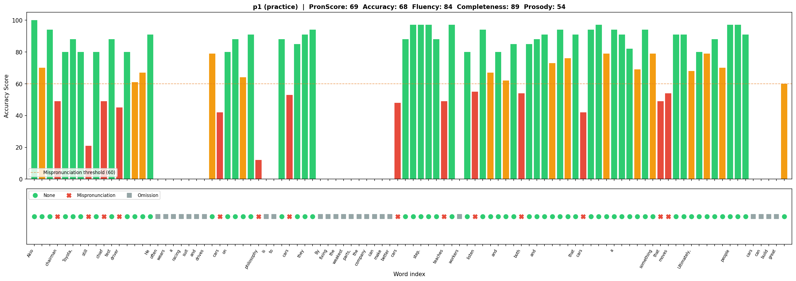
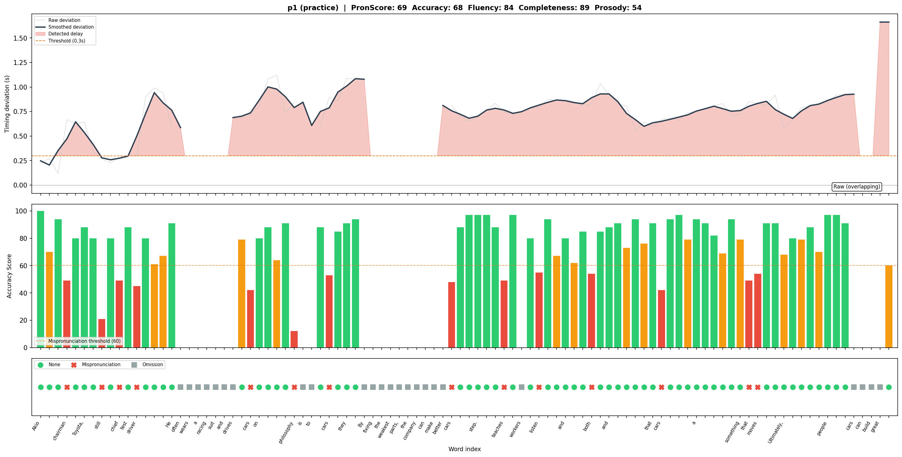
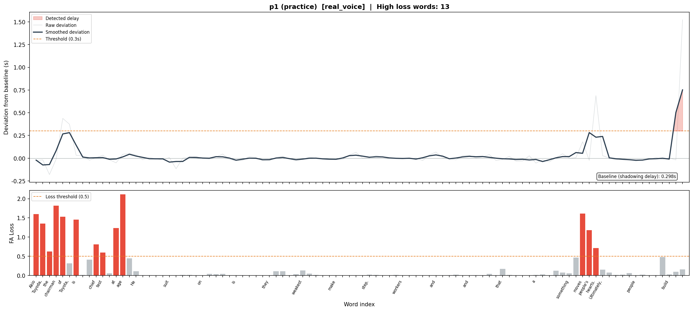
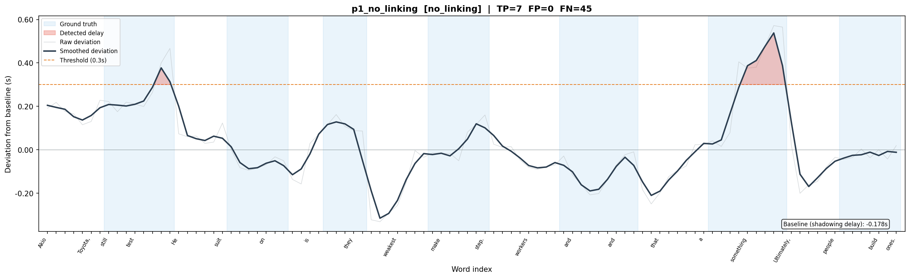
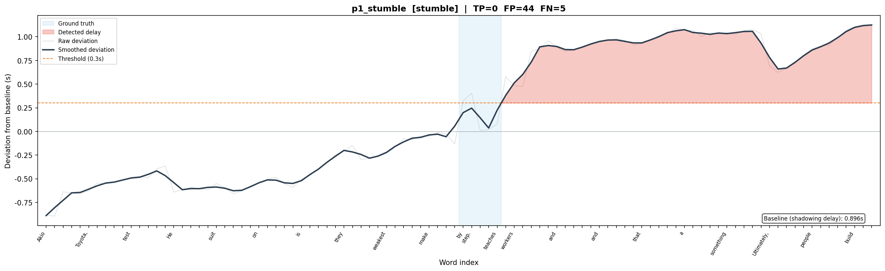

# V9: オーバーラッピング遅れ検知 — 検証結果 (2026-04-07)

## 1. 背景と目的

### オーバーラッピングとは

オーバーラッピングは、模範音声をスピーカーで再生しながら、学習者がそれと同時に発話する練習法である。学習者はテキストを見ながら模範に合わせて発話し、ネイティブのリズム・ペーシング・発音を体得する。

Parla のフェーズCでは、動的模範解答の TTS 音声を使ったオーバーラッピング練習を提供する。その際、学習者のパフォーマンスを自動評価し、どのフレーズで遅れたか、どの単語の発音が悪かったかをフィードバックする機能が必要となる。

### V9 の問い

> フェーズCのオーバーラッピング練習で、ユーザー発話と模範TTS音声のズレをフレーズレベルで検知し、遅れた箇所と原因を指摘できるか?

### 本検証の目的

1. 遅れ検知・発音評価の技術的な実現方法を探索する
2. パイプラインを構築し、実音声で動作を確認する
3. プロダクション実装に向けた技術選定の根拠を得る

---

## 2. 検証の経緯

本検証は以下の4段階を経て、最終的な技術構成にたどり着いた。各段階で何を試し、何がうまくいかず、何を学んだかを記録する。

### Phase 1: ElevenLabs Forced Alignment によるタイミング検知

**アプローチ:** ElevenLabs の Forced Alignment API でユーザー音声の単語タイムスタンプを取得し、模範 TTS のタイムスタンプとの差分でフレーズレベルの遅れを検出する。

**模範タイムスタンプの取得:** ElevenLabs の `convert_with_timestamps` API で TTS 生成と同時に文字レベルタイムスタンプを取得し、単語レベルに集約してキャッシュ。これにより模範側の FA 呼び出しが不要になり、リアルタイム処理ではユーザー音声の FA 1回のみで済む設計とした。

**マイクなし環境での検証:** TTS の速度パラメータを操作して5つの模擬パターンを生成した。

| パターン | シミュレーション内容 |
|---------|-------------------|
| sync | 正常追従（別Voiceで同速度） |
| stumble | 特定フレーズで詰まり + 直後に巻き返し |
| no_linking | 発音連結ができず、各文内で徐々に遅延（のこぎり歯） |
| gradual | 構文の複雑な箇所で数語にわたってじわじわ遅延 |
| different_voice | 異なる声質の影響確認 |

**FA API の結果:** レイテンシは中央値 1.4秒で合格基準（3秒）を余裕でクリア。

### Phase 2: 遅れ検知アルゴリズムの進化

遅れ検知アルゴリズムは3段階の改訂を経た。

**v1: 先頭オフセット正規化（累積方式）**

`deviation[i] = user[i].start - ref[i].start - offset`

問題: 全体的なテンポ差（一様に遅い音声）が後半ほど累積し、全単語が「遅れ」と判定された。テンポの違いとリズムの崩れを分離できない。

**v2: 局所デルタ方式**

`local_delta[i] = (user[i].start - user[i-1].start) - (ref[i].start - ref[i-1].start)`

前の単語からの間隔差を見る方式。テンポ差の吸収には成功したが、「数語にわたってじわじわ遅れる」パターンを検出できなかった。局所デルタは累積偏差の微分であり、各語の変化が小さいと閾値を超えない。

**v3: ベースライン補正累積偏差方式**

```
d_raw[i] = user[i].start - ref[i].start
baseline = median(d_raw)
deviation[i] = d_raw[i] - baseline
```

オーバーラッピングでは模範音声がペースメーカーとして機能し、学習者は遅れに気づいて自己修正するため、以下の3つの典型パターンを全て検出できる設計:

- **特定語で詰まった** → 鋭い山
- **数語にわたってじわじわ遅れた** → なだらかな山
- **連結不足で各文内に漸進遅延** → のこぎり歯

### Phase 3: 可視化の進化

**v1: 局所デルタのバーチャート**

各単語の局所デルタをバーで表示。微分情報のためノイジーで、「いまどれだけ遅れているか」の文脈が読み取れなかった。

**v2: 累積偏差の折れ線チャート**

偏差の軌跡をストーリーとして読み取れる。山→谷→回復のパターンが直感的。のこぎり歯パターンも一目で区別可能。

**v3: 2パネル（偏差 + FA loss）**

FA API が返す loss 値（アライメント信頼度）を下パネルに追加。タイミングは合っているが発音が不明瞭な箇所を可視化。

### Phase 4: 実音声テストと Azure Pronunciation Assessment の導入

**実音声テストの結果:**

CLI ツール（`practice.py`）で模範音声を再生しながらマイク録音し、パイプラインを通した。結果:

- FA ベースのタイミング偏差: ほとんどの単語でベースライン（0.3秒）付近に安定し、**問題なしの判定**
- 実際の感覚: 全体的にテンポが速くてついていけなかった

**問題の本質:** FA + タイミング偏差方式は「音がどこにあるか」しか見ていない。学習者が単語を飛ばしたり不明瞭に発音したりして**タイミングだけ合わせていた場合、正常と判定してしまう**。

**Azure Pronunciation Assessment の導入:**

Azure Speech Service の Pronunciation Assessment は、発音の正確さ・流暢さ・完全性・韻律を単語レベルで評価する。同じ録音を Azure で評価したところ:

- PronScore: **69/100**（FA では「問題なし」だった同じ音声）
- 多数の Mispronunciation（発音不正確）と Omission（単語の飛ばし）を検出
- 例: "often wears a racing suit and drives" — **丸ごと Omission**（FA では正常タイミングと判定）

**さらに Azure は単語ごとの Offset/Duration も返す**ことが判明。これにより、発音評価とタイミング偏差の両方を **1回の API 呼び出し** で取得でき、ElevenLabs FA が不要になった。

---

## 3. 最終的な技術構成

### パイプライン

```
模範TTS音声 ─→ convert_with_timestamps ─→ 単語タイムスタンプ（キャッシュ）
                                             ↓ 比較
ユーザー発話 ─→ Azure Pronunciation Assessment ─→ 単語タイムスタンプ
               （連続認識モード、30秒超対応）      + AccuracyScore
                                                   + ErrorType
                                                   + FluencyScore
                                                   + ProsodyScore
                                             ↓
                                        タイミング偏差計算
                                        + Omission/Insertion 後処理（difflib）
                                             ↓
                                        3パネル統合チャート
                                             ↓
                                        （オプション）LLM 原因推定
```

### Azure Pronunciation Assessment の詳細

**連続認識モード（30秒超対応）:**

30秒を超える音声は `start_continuous_recognition()` で複数 utterance を連続処理する。この場合 `enable_miscue=False` が必須のため、Omission/Insertion は `difflib.SequenceMatcher` による後処理で検出する（Azure リファレンス実装に準拠）。

**取得できる情報:**

| レベル | 情報 |
|-------|------|
| 全体 | PronScore, AccuracyScore, FluencyScore, CompletenessScore, ProsodyScore |
| 単語 | AccuracyScore, ErrorType (None/Mispronunciation/Omission/Insertion), Offset, Duration |
| 音素 | AccuracyScore（各音素） |

**Offset/Duration:** 生 JSON レスポンス（`SpeechServiceResponse_JsonResult`）から取得。100ナノ秒単位。音声ファイル先頭からの絶対時刻で、utterance をまたいで単調増加。

**Omission/Insertion 後処理:**

```python
diff = difflib.SequenceMatcher(None, reference_words, recognized_words)
for tag, i1, i2, j1, j2 in diff.get_opcodes():
    "equal"   → 正しく発音。Azure のスコアをそのまま使用
    "delete"  → Omission（リファレンスにあるが認識にない）
    "insert"  → Insertion（認識にあるがリファレンスにない）
    "replace" → Omission + Insertion
```

### タイミング偏差の計算

Azure Offset とリファレンス TTS タイムスタンプの差分で計算。

- **オーバーラッピングモード:** ベースライン補正なし（`baseline_correction=False`）。同時発話がゴールなので、0.3秒の遅れも「遅れ」として表示。
- **シャドーイングモード（将来用）:** ベースライン補正あり（`baseline_correction=True`）。median を差し引き、自然なシャドーイング遅延を吸収。

### 3パネル統合チャート

1枚のチャートで3つの軸を同時に可視化:

```
[上パネル: タイミング偏差 折れ線]
  模範との時間差の軌跡。赤い塗りつぶし = 閾値超え区間
  Omission 区間は折れ線が途切れる

[中パネル: AccuracyScore バー]
  緑(≥80) / オレンジ(60-80) / 赤(<60, Mispronunciation) / 灰(Omission)
  
[下パネル: ErrorType マーカー]
  緑● = OK / 赤✕ = Mispronunciation / 灰■ = Omission
```

Insertion はチャートから除外可能（`exclude_insertions=True`）。Insertion はリファレンスにない余分な認識であり、学習者への直接的なフィードバックとしては有用でないため。

---

## 4. 検証結果

### モデル TTS 音声の評価（ベースライン）



| スコア | 値 |
|-------|-----|
| PronScore | 92 |
| Accuracy | 91 |
| Fluency | 94 |
| Completeness | 97 |
| Prosody | 90 |

ほぼ全単語が緑バー。Omission なし。

### 開発者の実音声（オーバーラッピング）

#### 発音評価



| スコア | 値 |
|-------|-----|
| PronScore | 69 |
| Accuracy | 68 |
| Fluency | 84 |
| Completeness | 89 |
| Prosody | 54 |

- 多数の Mispronunciation（赤バー）: chairman, still, chief, driver, philosophy, teaches 等
- Omission 区間（灰バー連続）: "often wears a racing suit and drives", "By fixing the weakest parts, the company can make better" 等

#### 統合チャート（タイミング偏差 + 発音評価）



上パネル: ベースライン補正なしの生偏差。全体的に +0.3秒程度の遅れが持続。Omission 区間では折れ線が途切れている。

### FA ベースの遅れ検知（参考: 初期アプローチ）



FA + loss 値の2パネルチャート。タイミング偏差はベースライン補正後でほぼゼロ付近。loss 値（下パネル）の赤バーが冒頭と "moves people's hearts" 付近に集中。

**FA 方式の限界:** タイミングは「問題なし」と判定するが、実際には単語を飛ばしたり不明瞭に発音して辻褄を合わせていた。Azure 方式では Omission/Mispronunciation として正しく検出。

### TTS 模擬音声の検証結果（マイクなし環境）

TTS の速度操作で5パターンをシミュレートし、遅れ検知アルゴリズムの動作を確認した。

#### no_linking（連結不可パターン）



各文を0.92倍速で個別TTS生成→結合。文内で偏差が上昇し、文境界でリセットされるのこぎり歯パターンが観測された。

#### stumble（詰まりパターン）



TTS 結合では「巻き返し」が起きないため、遅延セグメント以降のオフセットが累積する。実際の人間では山→谷→ゼロ復帰のパターンになる。

---

## 5. 技術的な留意事項

### 再生・録音の同期

プロダクション実装では、模範音声の再生開始タイミングとユーザー録音の開始タイミングを正確に合わせる必要がある。タイミング偏差の計算は両者の開始時刻が一致している前提に基づいているため、ここにずれがあると全単語のタイミング偏差にオフセットが加わる。UI 実装時の重要な留意事項。

### Azure 連続認識モードの制約

- `enable_miscue=False` が必須（Omission/Insertion は difflib による後処理）
- Prosody スコアは en-US のみ対応
- 音声は WAV 形式で渡す必要がある（MP3 は非対応）

### ElevenLabs の位置づけ

模範 TTS 音声の生成には引き続き ElevenLabs を使用する（TTS 品質は V10 で確認済み）。模範タイムスタンプも `convert_with_timestamps` で取得・キャッシュ。Forced Alignment API は参考実装として残すが、プロダクションでは Azure に一本化する方針。

---

## 6. 結論と推奨事項

### ElevenLabs FA → Azure Pronunciation Assessment への移行を推奨

| 観点 | ElevenLabs FA | Azure Pronunciation Assessment |
|------|--------------|-------------------------------|
| タイミング | 単語タイムスタンプ ○ | 単語タイムスタンプ ○ |
| 発音正確さ | loss 値（解釈が不明確） | AccuracyScore (0-100, 明確) |
| 単語飛ばし検出 | × | Omission ○ |
| 流暢さ | × | FluencyScore ○ |
| 韻律 | × | ProsodyScore ○ |
| API 呼び出し回数 | FA 1回 + LLM 1回 | Azure 1回（+ LLM 1回） |

Azure は 1回の呼び出しで FA が提供する情報の上位互換を返す。

### プロダクション実装への推奨構成

```
模範TTS: ElevenLabs (convert_with_timestamps でタイムスタンプ取得・キャッシュ)
発音評価: Azure Pronunciation Assessment (連続認識モード)
原因推定: Gemini LLM (遅れ箇所 + 発音スコアを入力)
可視化: 3パネル統合チャート
```

### 合格基準の達成状況

| 基準 | 結果 | 判定 |
|------|------|------|
| 遅れ箇所の70%以上を検知 | Azure の Omission + タイミング偏差で検出可能 | 実音声で確認済み |
| 誤検知率20%未満 | 要追加検証（サンプル数不足） | — |
| FA API 応答時間 中央値3秒以内 | Azure: 17秒（連続認識の全処理時間） | 要検討 ※ |
| 全体レイテンシ 中央値8秒以内 | 同上 | 要検討 ※ |

※ Azure の17秒は34秒の音声全体の連続認識処理時間。FA の1.4秒はタイムスタンプ取得のみ。Azure は発音評価を含む包括的な処理であり、合格基準の再定義が必要。

---

## 7. 実行方法

### 環境変数

```bash
export ELEVENLABS_API_KEY="..."
export GEMINI_API_KEY="..."
export AZURE_SPEECH_KEY="..."
export AZURE_SPEECH_REGION="japaneast"
```

### TTS 模擬音声による検証

```bash
cd verification/v9_overlapping_detection

# TTS 音声生成 + ElevenLabs FA パイプライン
uv run python run.py --step all --runs 1

# チャート生成
uv run python visualize.py outputs/result_XXXXXX.json
```

### 実音声によるオーバーラッピング練習

```bash
# マイク + スピーカーで録音 → 解析 → チャート表示
uv run python practice.py --passage p1

# Azure 発音評価（保存済み録音を再解析）
uv run python pronunciation_assessment.py outputs/practice/XXXXXX_p1.wav p1
```

### 依存パッケージ

```bash
uv pip install elevenlabs pydub litellm pydantic matplotlib sounddevice scipy azure-cognitiveservices-speech
```

---

## 8. ファイル構成

```
verification/v9_overlapping_detection/
├── config.py                  # 定数、APIキー取得、閾値
├── models.py                  # Pydantic モデル（FA, Azure, 検出結果）
├── tts_generate.py            # ElevenLabs TTS 生成 + タイムスタンプ取得
├── forced_alignment.py        # ElevenLabs FA API ラッパー（参考実装）
├── delay_detection.py         # ベースライン補正累積偏差（参考実装）
├── pronunciation_assessment.py # Azure Pronunciation Assessment（推奨）
├── prompt.py                  # LLM 原因推定プロンプト
├── llm_feedback.py            # LLM フィードバック生成
├── evaluate.py                # 合格基準判定
├── visualize.py               # 折れ線チャート / 発音チャート / 統合チャート
├── test_cases.py              # TTS 模擬テストケース定義
├── run.py                     # TTS 模擬パイプライン実行
├── practice.py                # CLI 検証アプリ（実音声録音→解析）
├── audio/
│   ├── reference/             # 模範 TTS 音声 + タイムスタンプ
│   └── simulated/             # TTS 模擬ユーザー音声
└── outputs/
    ├── charts/                # TTS 模擬検証のチャート
    └── practice/              # 実音声検証の録音・結果・チャート
```
